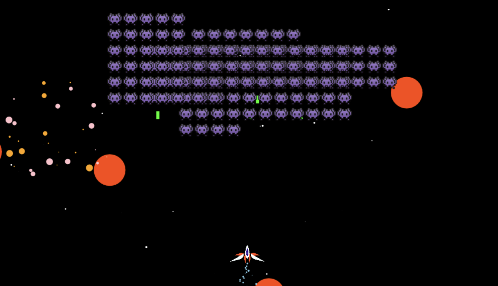

# Space Invaderz Ultra



Deployed Site: https://space-invaderz-ultra-wyne.netlify.app/

&nbsp;

## Project Goal

To create a 2D Space Invaders game with powerups, increasingly difficult enemies, a scoring system, amazing soundtrack and just overall fun to play. The game is at its base version at the moment.

&nbsp;

## Learning Outcomes

- Class & Object heavy project: using object functions and meshing that in with the overall game animation functions
- Basic 2D Game Development
- Canvas functions
- Geometry: Projectile and Sprite collisions, collision detection
- Overall usage of programming fundamentals

&nbsp;

### Scope

**Basics:**

- Poject Setup
- Create a Player
- Allow the Player to move
- Create Projectiles
- Create an Invader
- Create and move grids of invaders
- Spawn grids at intervals
- Allow invaders to shoot back
- Enemy explosions
- Create background
- Create lose conditions
- Score functionality
- Fixed-width for the canvas

**Features:**

- Dynamic score labels
- Bombs
- Machine gun power-up
- Progressively harder enemies/levels
- Spaceship sprite animation
- Start and Game Over UI
- Sound effects and Music

&nbsp;

## Technologies used:

### Languages
- [HTML5](https://en.wikipedia.org/wiki/HTML5)
- [CSS3](https://en.wikipedia.org/wiki/Cascading_Style_Sheets)
- [Javascript](https://www.javascript.com/)

### IDE
- [Visual Studio Code](https://code.visualstudio.com/) - The IDE used to code the website.

### Frameworks, Libraries, CDN's, Resources etc.

- [Howler.js](https://howlerjs.com/)
- [GSAP](https://github.com/greensock/GSAP)

&nbsp;

## Forking the Repository

You can fork the repository through the following steps. Forking the repository means you will have a copy of the repository and any changes you make will not affect the original repository.

1. Log in to GitHub and locate the GitHub Repository. Here is a link for the [repository](...)
2. At the top of the Repository (not top of page) just above the "Settings" Button on the menu. Looking towards the right of the page. Locate the button "Fork" then click
3. You should now have a copy of the original repository in your GitHub account

&nbsp;

## Local Clone

This is used when you would like to make changes to the project code

1. Should you wish to use a different IDE like VSCode. You first log in to Github and locate the required repository. Here is the link for this [repository](...)
2. Open a new terminal on Git Bash
3. Type `git clone`, and then paste the URL you copied

```
git clone https://github.com/wyne-ybanez/Space-InvaderZ.git
```

Here is a link that can explain this process further. [Click Here](https://help.github.com/en/github/creating-cloning-and-archiving-repositories/cloning-a-repository#cloning-a-repository-to-github-desktop)

4. You can just run `index.html` on your browser.

&nbsp;

## Deployment

Project is deployed on Netlify.

&nbsp;

## Bugs

* ...

&nbsp;

## Content & Media

Special thanks to these content creators for their free content.

- GameSupplyGuy for "200+ Space Sound Effects (Various Futuristic SFX)"
- Cwupcwake for "Basic game 8bit game sound"
- Goose Ninja for "Space Music Pack"
- Eclipzodiac for "RPG Battle music - RPG Maker Mix V1.25"

&nbsp;

## Future Implementations

- Mobile responsiveness with touch screen functions
- Boss Battles
- Log player scores in local storage or in a JSON database
- Display last score earned
- Additional power ups
- Level System

&nbsp;

## Acknowledgements

- Special Thanks to Christopher Lis for his [tutorial](https://www.udemy.com/course/space-invaders-with-javascript-and-html-canvas/) on how to create this game and to develop it further.

- Thanks to friends and family for playing this game and testing it out for me.
